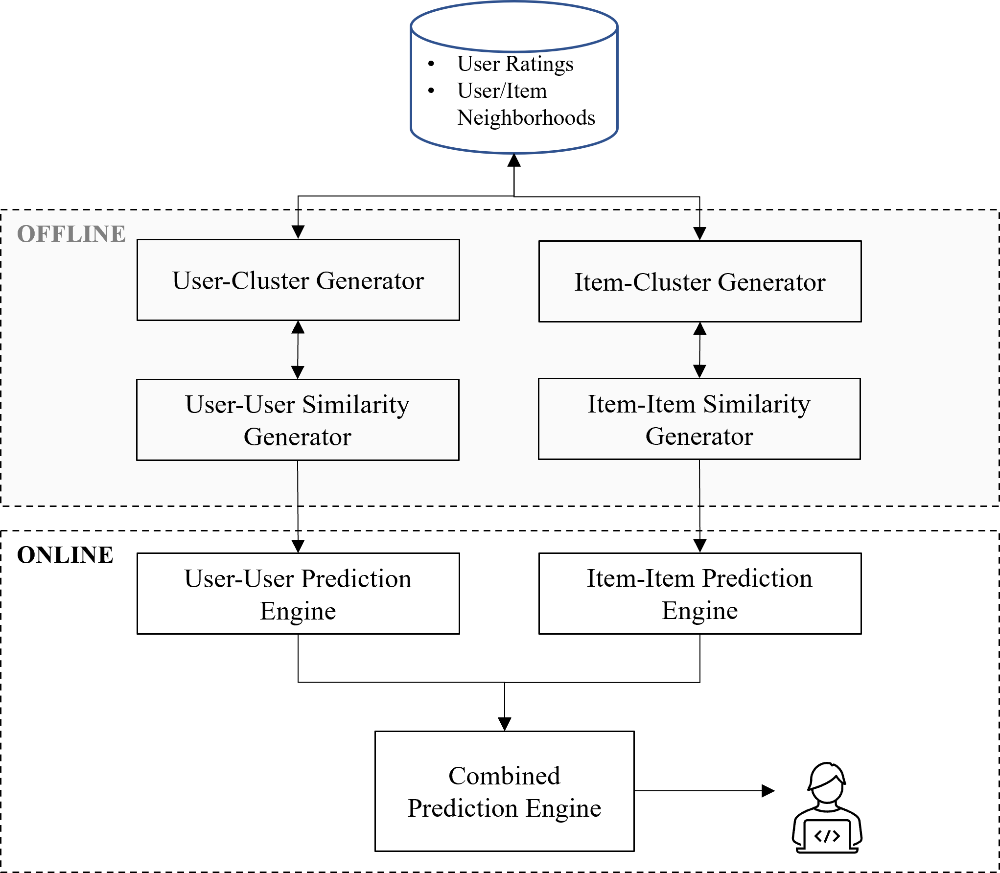
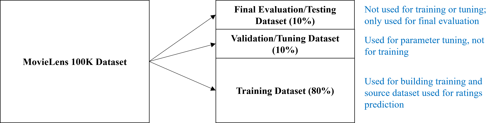
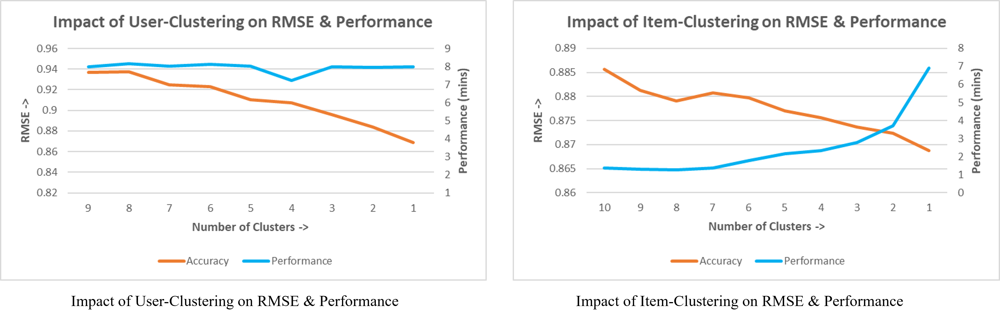

# 🎬 Movie-Recommendation-Engine-based-on-Collaborative-Filtering-Techniques
In today’s internet-propelled world and the rapidly evolving era of Artificial Intelligence, it is a common expectation that the systems we interact with are smart enough to “know” what we want, perhaps better than even ourselves. Recommendations are now considered table-stakes in most eCommerce and other systems. Approximately 80% of the content watched on Netflix is discovered through its personalized recommendations, highlighting the system's effectiveness in guiding viewer choices. 

A movie recommendation engine helps users discover films tailored to their tastes by analyzing past preferences and similarities with other users. It enhances user experience, drives engagement, and reduces decision fatigue by delivering personalized, relevant suggestions in real time.

## 📌 Project Overview
This project designs and implements a movie recommendation engine from scratch for the [MovieLens](https://grouplens.org/datasets/movielens/) 100k real-life dataset, using collaborative filtering recommendation techniques for both **User-based** and **Item-based** methods, and adds a hybridization algorithm to combine results from the two independent recommenders into a singular output. It focuses on addressing the core challenges faced by such systems such as:

- **High data sparsity**
- **Cold start** problems
- **Scalability** constraints

## 🧠 Key Features

- **User-based collaborative filtering** using Pearson Correlation
- **Item-based collaborative filtering** using Cosine Similarity
- **Hybridization engine** using a weighted average approach
- **Naïve clustering** to improve scalability (using **K-means** clustering)
- **Discount factor** applied to similarity calculations for better reliability
- **MovieLens 100k** dataset for experimentation and validation

## ⚙️ Architecture

- **Offline Phase**: Clustering + similarity computation
- **Online Phase**: Real-time rating prediction using precomputed values
- **Hybrid Engine**: Combines predictions from user and item recommenders




## 📝 Evaluation Plan

Evaluation criteria for recommendation systems tend to be multi-faceted, with no single criterion capturing the essence of all system goals.
- Ratings Accuracy and the impact of Clustering on performance and accuracy will be the main evaluation metrics. 
- Standard training, tuning and evaluation practices based on emperical methods common in Machine Learning are employed.



## 📊 Results

| System                    | MAE    | RMSE   |
|---------------------------|--------|--------|
| User-Based CF             | 0.6753 | 0.8823 |
| Item-Based CF             | 0.7028 | 0.9236 |
| **Hybrid CF (0.65/0.35)** | **0.6632** | **0.8687** |

- **Sparsity Alleviation**: 95.57% rating coverage
- **Cold Start Benefit**: 12% of predictions were exclusive to one system

Impact of clustering on accuracy and performance was measured empirically on the fully tuned system against the evaluation dataset for both user/item engines.



## 🔍 Discussion
The primary purpose of this project was to improve the quality of recommendations to users of an online movie application by combining individual collaborative filtering systems as a hybrid system. A hybrid recommendation system was built from the ground-up with the main intent of evaluating and measuring the usefulness of combining user-based and item-based systems.

- A basic hybrid combination of individual collaborative filtering systems provides better recommendations.
- Ratings prediction accuracy gains between **2%** to **6%** were realized compared to the individual systems.
- Even with a highly sparse dataset (~98%), the hybrid system generated predictions for **>95%**, thus significantly alleviating data sparsity problems inherent with real-world applications.
- 12% of predicted ratings were exclusive to one or the other base system, justifying the benefits of hybridized systems for the **cold start** problem
- Clustering: Both User and Item engine accuracies benefited from clustering. Clustering on the larger dimension (items) significantly impacted performance, albeit only in the offline phase. It's possible to select an acceptable trade-off between accuracy and performance.


## 📈 Future Enhancements

- Implement more sophesticated k-means clustering for peer grouping
- Train on larger datasets (e.g., MovieLens 1M+)
- Deploy scalable infrastructure (e.g., Hadoop, Spark)
- Add a modern web interface for real-time recommendations
- Dynamically learn hybrid weights using regression or per-user/item profiling

## 📚 References

- MovieLens Dataset: https://grouplens.org/datasets/movielens/
- Key Literature:  
  - Aggarwal, C. (2016). *Recommender Systems*, Springer  
  - Su & Khoshgoftaar (2009). *A Survey of Collaborative Filtering Techniques*  
  - Burke (2002). *Hybrid Recommender Systems*  

## 🚀 Getting Started

To run the system locally:

```bash
# Clone the repo
git clone Movie-Recommendation-Engine-based-on-Collaborative-Filtering-Techniques.git

# Run hybrid system
python HybridRecommender.py
```
