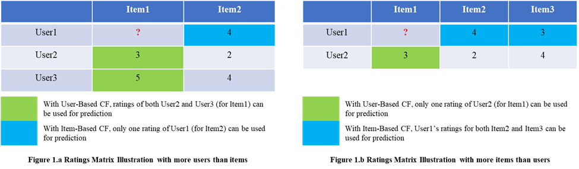

# 🎬 Movie-Recommendation-Engine-based-on-Collaborative-Filtering-Techniques
In today’s internet-propelled world and the rapidly evolving era of Artificial Intelligence, it is a common expectation that the systems we interact with are smart enough to “know” what we want, perhaps better than even ourselves. Recommendations are now considered table-stakes in most eCommerce and other systems. Approximately 80% of the content watched on Netflix is discovered through its personalized recommendations, highlighting the system's effectiveness in guiding viewer choices. 

A movie recommendation engine helps users discover films tailored to their tastes by analyzing past preferences and similarities with other users. It enhances user experience, drives engagement, and reduces decision fatigue by delivering personalized, relevant suggestions in real time.

## 📌 Project Overview
This project designs and implements a movie recommendation engine from scratch for the  100k real-life dataset, using collaborative filtering recommendation techniques for both **User-based** and **Item-based** methods, and adds a hybridization algorithm to combine results from the two independent recommenders into a singular output. It focuses on addressing the core challenges faced by such systems such as:

- **High data sparsity**
- **Cold start** problems
- **Scalability** constraints

